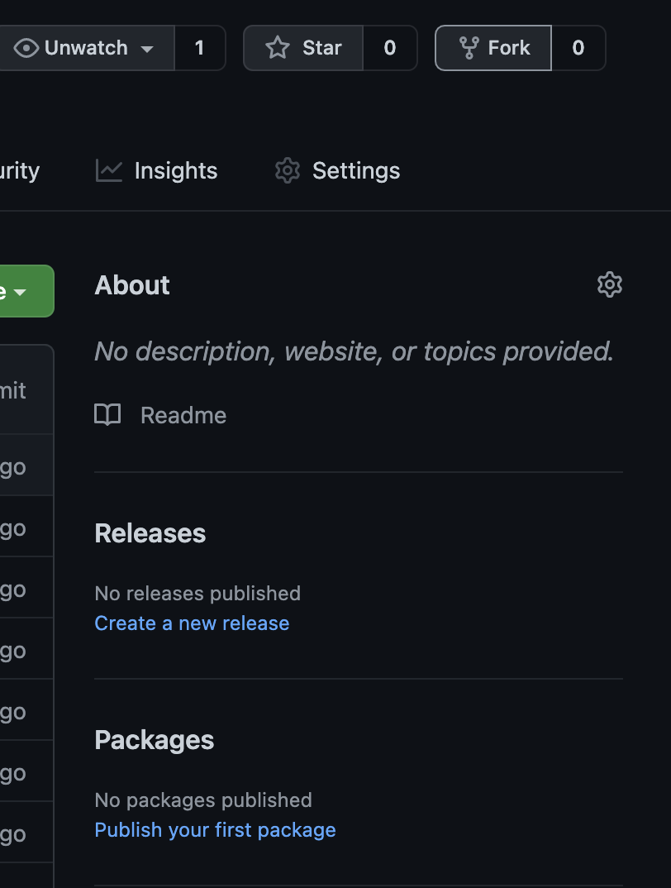

### Cool Easy Code Challenges

* These code challenges are meant to be easy and keep your brain thinking.

* They should only take 15 min per test and function the key is repetition so write out every test and function.

Steps to get these on your computer.
1. Fork up at the top
    
2. Clone down 
    
    ```
    git clone 'your url from the fork'
    ```
3. To Validate it is there and then
    ```
    ls
    ```  
 
    ```
        cd 'the file'
    ``` 
    ```
    code .
    ``` 

